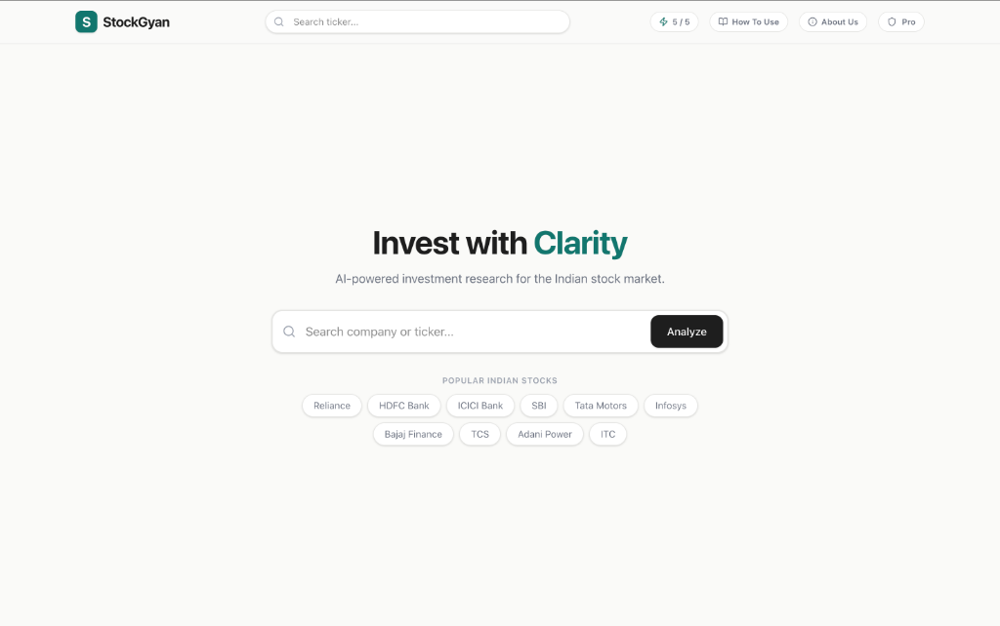

# 📈 StockGyan

> **"Chatbots guess. We calculate."**

StockGyan is an experimental, AI-powered financial research platform explicitly designed for the Indian Stock Market (NSE/BSE). By combining deterministic financial modeling with advanced Large Language Models (LLMs), StockGyan provides deep, instant, and human-readable analysis of any Indian stock.

 *(Note: Replace with actual screenshot)*

## ✨ Features

- **Multi-Agent Architecture**: Built with LangGraph, StockGyan utilizes a network of AI agents to pull real-time data, parse financial statements, analyze market sentiment, and generate a final verdict.
- **Deterministic Verdict Engine**: We don't let AI guess your financial future. We calculate a strict 100-point Investment Score using the Yahoo Finance API (P/E Ratio, Revenue Growth, ROE, Debt, etc.) before the LLM ever sees it.
- **Learning vs. Pro Modes**: Toggle between 'Learning Mode' (where complex metrics are explained using simple analogies) and 'Pro Mode' (unfiltered data and advanced ratios for seasoned investors).
- **Wealth Journey**: A visual timeline showing exactly how a ₹1,00,000 investment in a stock would have performed over 1, 3, and 5 years compared to the NIFTY 50 index.
- **Beautiful UI/UX**: A state-of-the-art interface built with React, TailwindCSS v4, and buttery-smooth scroll animations powered by GSAP.

## 🛠️ Tech Stack

### Frontend (Client)
- **Framework**: React 18 + Vite
- **Styling**: TailwindCSS v4
- **Animations**: GSAP (GreenSock) & Framer Motion
- **Icons**: Lucide React
- **Routing**: React Router DOM

### Backend (Server)
- **Runtime**: Node.js + Express
- **AI/LLM Framework**: LangGraph & LangChain
- **LLM Provider**: Groq (Llama 3.3 70B Versatile)
- **Data Providers**: Yahoo Finance (yahoo-finance2) & GNews API

## 🚀 How It Works (The 5-Step Methodology)

1. **Validation**: We verify the ticker against the NSE/BSE registry.
2. **Data Extraction**: The `fetchFinancials` node scrapes live pricing, income statements, and balance sheets.
3. **News Sentiment**: The `fetchNews` node pulls the latest headlines to detect market sentiment and potential red flags.
4. **Scoring Engine**: Our deterministic math model scores the company out of 100 based on Financial Health (35%), Valuation (20%), Growth (20%), Sentiment (15%), and Risk (10%).
5. **AI Synthesis**: Llama 3.3 analyzes the raw data alongside the calculated score to write a highly conversational, easy-to-digest report.

## 💻 Local Development

Want to run StockGyan on your own machine? It's incredibly simple.

1. **Clone the repository:**
   ```bash
   git clone https://github.com/AyushAgrawal2004/StockGyan.git
   cd StockGyan
   ```

2. **Set up Environment Variables:**
   Create a `.env` file in the root directory and add your Groq API key:
   ```env
   GROQ_API_KEY=gsk_your_groq_api_key_here
   ```

3. **Install Dependencies & Run:**
   The project is configured to run both the frontend and backend concurrently from the root directory.
   ```bash
   npm install
   npm run dev
   ```
   *Frontend will run on `http://localhost:5173` and Backend on `http://localhost:5001`.*

## 🌍 Production Deployment

StockGyan is architected for zero-database, serverless-friendly deployment. 

### 1. Deploying the Backend (Render)
We recommend deploying the backend to an always-on service like **Render (Web Service)** so the in-memory token rate-limiter functions correctly.
- **Root Directory**: `server`
- **Build Command**: `npm install`
- **Start Command**: `node index.js`
- **Environment**: Add `GROQ_API_KEY`.

### 2. Deploying the Frontend (Vercel)
Once the backend is live, you can deploy the lightning-fast frontend to Vercel.
- **Root Directory**: `client`
- Vercel will automatically detect Vite and run `npm run build`.
- *Note: Our frontend automatically detects production environments and routes API calls to the live Render backend URL.*

## ⚠️ Disclaimer

StockGyan is an experimental AI project. The insights, scores, and verdicts provided are for **educational and informational purposes only**. This is **not financial advice**. Always consult a SEBI-registered financial advisor before making real investments in the stock market. Historical performance does not guarantee future results.
